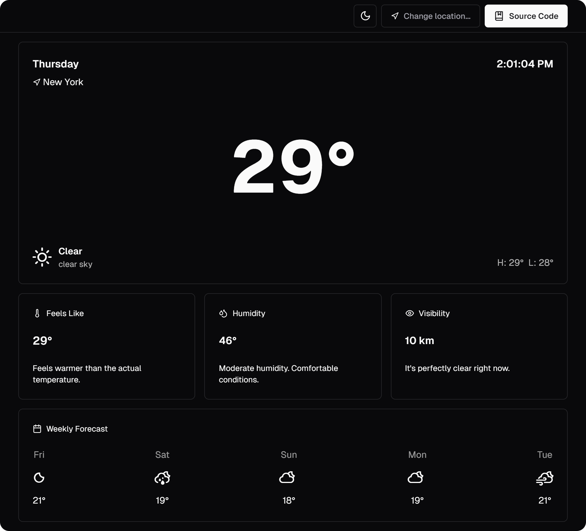

# Weather App

Weather app with [Next.js](https://nextjs.org) v14 typescript, [Tailwind CSS](https://tailwindcss.com), [shadcn/ui](https://ui.shadcn.com/) and [OpenWeather API](https://openweathermap.org/).



## Setup

1. Take a copy of .env.example and re-name to .env.local
2. Get your OpenWeather API key
3. Enter the details into the .env.local file
4. Start the dev server with the following scripts

```shell
# Install dependencies
$ npm install

# Start dev server with hot reload at localhost:3000
$ npm run dev
```

Open http://localhost:3000 with your browser to see the result.

You can start editing the page by modifying app/page.tsx. The page auto-updates as you edit the file.

## Credits

Based on [DariusLukasukas/nextjs-weather-app](https://github.com/DariusLukasukas/nextjs-weather-app/)

Weather data provided by [OpenWeather API](https://openweathermap.org/)
